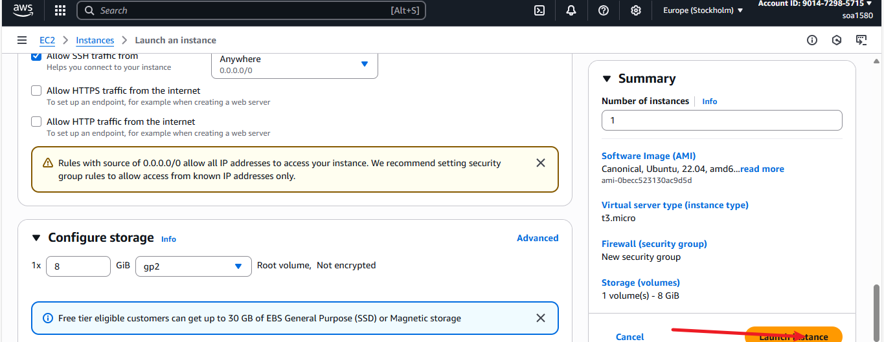
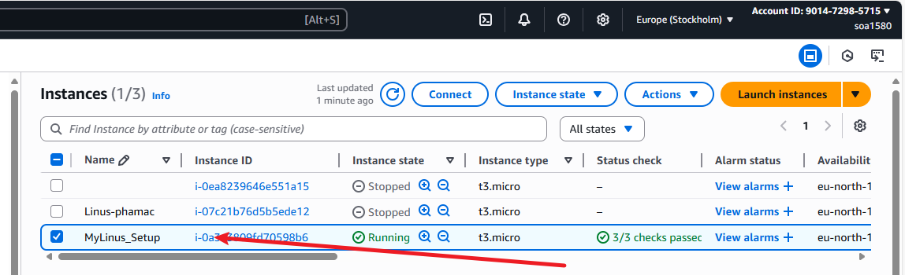

# Linus-Installation-and-Initial-Setup

## The Implementation of how I Set up my Linus Cloud account on AWS Website (EC2), then linked it to my local Machine

1. ### Signed into my AWS cloud account

2. ### Clicked and creating EC2 instance for the first time

3. ### Successfully launched the initiated EC2 instance and the instance summary page

4. ### Connected the EC2 instance (The Cloud Server) to my local machine

